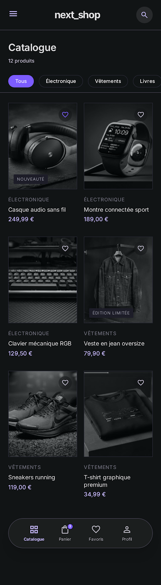
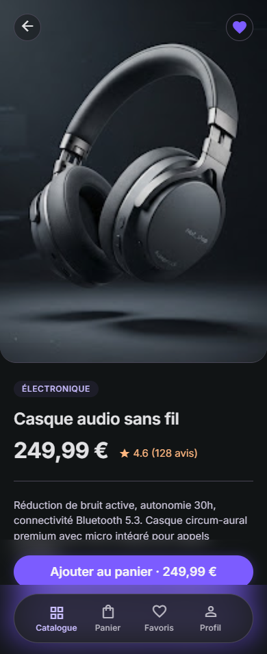
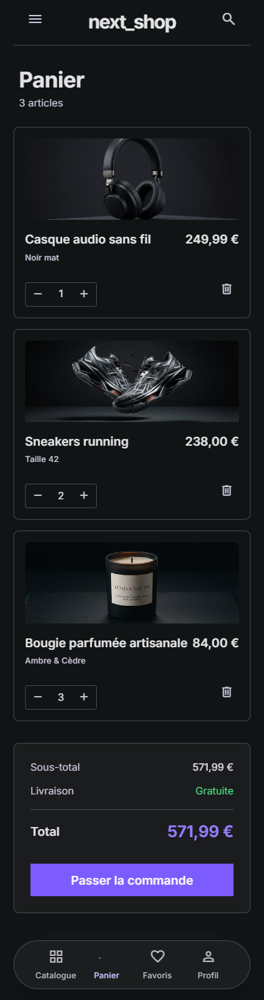
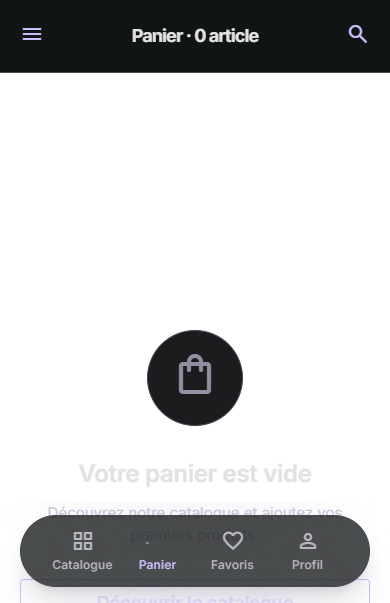
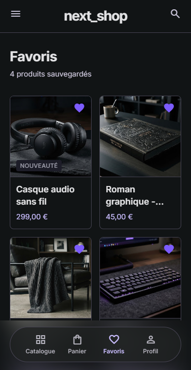
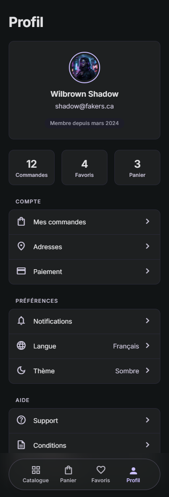

# next_shop

Application e-commerce Flutter développée pour la **certification nextFlutter — Riverpod**.
Valide la maîtrise de la gestion d'état Riverpod à travers une application réelle : catalogue, panier, favoris persistés, filtrage/tri, profil utilisateur.

---

## Aperçu

| Catalogue | Détail produit | Panier |
|---|---|---|
|  |  |  |

| Panier vide | Favoris | Profil |
|---|---|---|
|  |  |  |

Direction artistique **Studio Noir** — dark premium éditorial, hairline borders, accent violet `#7C5CFF`.

---

## Stack technique

| Package | Version | Rôle |
|---|---|---|
| `flutter_riverpod` | `^3.4.2` | State management (Notifier / AsyncNotifier / FutureProvider) |
| `go_router` | `^17.5.0` | Navigation déclarative avec `StatefulShellRoute.indexedStack` |
| `shared_preferences` | `^2.5.5` | Persistance locale des favoris |
| `intl` | `^0.20.3` | Formatage devise + dates en français |
| `equatable` | `^2.1.0` | Égalité par valeur (critique pour Riverpod) |

Style Riverpod : **manuel classique** (Notifier / AsyncNotifier — les remplaçants modernes des `StateNotifier` dépréciés). Pas de code generation.

---

## Architecture

Structure **feature-first** avec séparation stricte des couches :

```
lib/
├── main.dart                            Bootstrap (SharedPreferences + intl fr_FR + ProviderScope)
│
├── core/                                Utilitaires transverses
│   ├── constants/app_assets.dart        Chemins d'assets centralisés
│   ├── router/                          go_router + RouteNames
│   ├── theme/app_theme.dart             Tokens Studio Noir
│   └── utils/formatters.dart            Formatters.euros / monthYear / categoryLabel
│
├── data/                                Couche données
│   ├── models/                          Product, CartItem, UserProfile, ProductFilter
│   ├── sources/                         ProductLocalSource (JSON), FavoritesStorage (prefs)
│   └── repositories/                    ProductRepository (façade métier)
│
├── features/                            Une feature = un dossier autonome
│   ├── catalog/
│   │   ├── providers/                   product_providers, filter_provider
│   │   ├── widgets/                     ProductCard, CategoryChips, SearchField, SortBottomSheet…
│   │   └── pages/                       CatalogPage, ProductDetailPage
│   ├── cart/
│   │   ├── providers/cart_provider.dart
│   │   ├── widgets/                     CartItemTile, CartSummary
│   │   └── pages/cart_page.dart
│   ├── favorites/
│   │   ├── providers/favorites_provider.dart
│   │   └── pages/favorites_page.dart
│   └── profile/
│       ├── providers/user_provider.dart
│       └── pages/profile_page.dart
│
└── shared/widgets/                      Widgets réutilisables (LoadingView, Skeleton, ErrorView…)

assets/
└── products.json                        12 produits sur 4 catégories

test/
├── helpers/product_fixtures.dart
├── providers/                           30 tests unitaires providers
└── widget_test.dart                     Smoke test
```

### Principe de séparation

- **`data/`** ne connaît pas Riverpod. Modèles + I/O purs et testables sans framework.
- **`features/**/providers/`** est la seule couche qui dépend de Riverpod.
- **`features/**/pages/` + `widgets/`** consomment les providers, ne les créent pas.

Aucun widget ne fait d'appel réseau, ne lit un fichier, ne parse du JSON. Toute logique métier vit dans les providers ou les repositories.

---

## Les 14 providers

L'exigence minimale est **5 providers distincts**. Le projet en expose **14**, couvrant tous les types Riverpod.

| # | Provider | Type | Rôle |
|---|---|---|---|
| 1 | `sharedPreferencesProvider` | `Provider<SharedPreferences>` | Overridé au bootstrap dans `ProviderScope` |
| 2 | `favoritesStorageProvider` | `Provider<FavoritesStorage>` | Wrapper typé sur prefs |
| 3 | `productRepositoryProvider` | `Provider<ProductRepository>` | Injection du repository |
| 4 | `productsProvider` | `FutureProvider<List<Product>>` | Chargement de la liste depuis JSON |
| 5 | `productByIdProvider` | `FutureProvider.family<Product, String>` | Fiche produit paramétrée par id, cache par id |
| 6 | `filterProvider` | `NotifierProvider<FilterNotifier, ProductFilter>` | Catégorie + tri + recherche |
| 7 | `filteredProductsProvider` | `Provider<AsyncValue<List<Product>>>` | **Dérivé** — combine products + filter |
| 8 | `categoriesProvider` | `Provider<AsyncValue<List<String>>>` | **Dérivé** — catégories uniques depuis JSON |
| 9 | `cartProvider` | `NotifierProvider<CartNotifier, List<CartItem>>` | Panier avec add/remove/qty |
| 10 | `cartTotalProvider` | `Provider<double>` | **Dérivé** — somme des subtotals |
| 11 | `cartItemCountProvider` | `Provider<int>` | **Dérivé** — somme des quantités (badge nav) |
| 12 | `favoritesProvider` | `AsyncNotifierProvider<FavoritesNotifier, Set<String>>` | Init async depuis prefs + toggle + persist |
| 13 | `isFavoriteProvider` | `Provider.family<bool, String>` | **Dérivé** — un bool par produit (heart isolé) |
| 14 | `favoriteProductsProvider` | `Provider<AsyncValue<List<Product>>>` | **Dérivé** — join favorites × products |
| — | `userProvider` | `FutureProvider<UserProfile>` | Profil mocké |

**Types de providers couverts** : `Provider`, `Provider.family`, `FutureProvider`, `FutureProvider.family`, `NotifierProvider`, `AsyncNotifierProvider`, providers dérivés. C'est un panorama complet de l'API Riverpod.

### Graphe de dépendances

```
sharedPreferencesProvider (overridden)
    └── favoritesStorageProvider
            └── favoritesProvider (AsyncNotifier)
                    ├── isFavoriteProvider.family(id)
                    └── favoriteProductsProvider ◄── productsProvider

productRepositoryProvider
    └── productsProvider ─┬── productByIdProvider.family(id)
                          └── filteredProductsProvider ◄── filterProvider (Notifier)
                              categoriesProvider

cartProvider (Notifier) ─┬── cartTotalProvider
                         └── cartItemCountProvider

userProvider
```

Aucune circularité. Chaque provider dérivé recompute automatiquement quand ses dépendances changent — c'est la propagation Riverpod.

---

## Fonctionnalités

### Catalogue
- Liste 2 colonnes avec `ProductCard` (image + catégorie + nom + prix + rating + cœur)
- Barre de filtres par catégorie via `ChoiceChip`
- Tri via `SortBottomSheet` (4 options)
- Recherche full-text (nom + description)
- **Pull-to-refresh** via `ref.invalidate(productsProvider)`
- Skeleton **shimmer** pendant le chargement (aucune dépendance externe)
- Empty state avec bouton "Réinitialiser" les filtres

### Détail produit
- Hero image plein écran (400px)
- Overlays back + cœur (semi-transparent noir)
- Quantity stepper local (`setState`)
- Bouton sticky `Ajouter au panier · [total]`
- **SnackBar via `ref.listen`** quand le compteur panier augmente

### Panier
- **Empty state conditionnel** via un simple `if (items.isEmpty)`
- Cartes larges avec image paysage (16:9)
- Stepper compact par ligne (`+` / `-`)
- **Swipe-to-delete** (`Dismissible`)
- Summary sticky : sous-total / livraison gratuite / total violet
- Checkout mock : dialog de confirmation → clear cart → SnackBar

### Favoris
- Grille identique au catalogue (réutilise `ProductCard`)
- **Empty state** avec CTA vers catalog
- Provider dérivé qui **combine** favoritesProvider + productsProvider

### Profil
- Avatar circulaire avec ring gradient violet
- Chip "Membre depuis mars 2024" (via `intl` locale-aware)
- 3 stat cards **indépendantes** (chacune watch un provider différent)
- Menu groupé (Compte / Préférences / Aide) avec section "Se déconnecter" destructive

---

## États UI systématiques

Tout provider async utilise `AsyncValue.when(...)` pour couvrir les 3 états :

- **Loading** → skeleton shimmer (grille pour catalog, layout mimetic pour détail)
- **Error** → `ErrorView` avec bouton "Réessayer" qui appelle `ref.invalidate(...)`
- **Data** → contenu réel, ou `EmptyView` si liste vide

Zéro `FutureBuilder`. Zéro if/else sur "en cours de chargement". Tout passe par `.when`.

---

## Tests

**32 tests unitaires — 100% passent.**

```bash
flutter test
```

Découpage :

- **`cart_notifier_test.dart`** (11 tests) — add / remove / quantities / clear + providers dérivés
- **`favorites_notifier_test.dart`** (9 tests) — init async depuis prefs / toggle / persistance / isFavorite / join
- **`filter_notifier_test.dart`** (10 tests) — mutations + filteredProductsProvider (category / search / sort / combinés)
- **`widget_test.dart`** (1 test) — smoke test l'app boot

**Techniques Riverpod démontrées** :
- `ProviderContainer` isolé par test (pas de widget tree)
- `overrideWithValue(prefs)` pour SharedPreferences mocké
- `overrideWith((ref) async => ...)` pour FutureProvider fake
- `container.read(asyncProvider.future)` pour attendre l'init d'un AsyncNotifier

---

## Getting started

Prérequis : **Flutter 3.x**, **Dart 3.9+**.

```bash
# 1. Cloner
git clone <repo-url>
cd nextFlutterEcommerceApp

# 2. Dépendances
flutter pub get

# 3. Lancer
flutter run           # sur émulateur/device connecté
flutter run -d chrome # sur Chrome pour tester rapidement

# 4. Tests
flutter test

# 5. Analyse statique
flutter analyze
```

---

## Design system — Studio Noir

Direction artistique générée via **Google Stitch** avec un prompt sur-mesure (voir `docs/screenshots/`).

### Tokens de couleur

| Token | Valeur | Usage |
|---|---|---|
| `background` | `#0B0B10` | Fond de scaffold |
| `surface` | `#16161E` | Cards, sheets |
| `surfaceSubtle` | `#1D1D28` | Hover, skeleton base |
| `borderHairline` | `#2A2A38` | Séparateurs 1px (pas d'ombres) |
| `seed` (primary) | `#7C5CFF` | Accents, CTA, active state |
| `textPrimary` | `#F5F5F7` | Corps de texte |
| `textSecondary` | `#A0A0AD` | Captions, labels |

### Principes

- **Elevation par teinte** (jamais d'ombre)
- **Hairline borders** partout (1px `#2A2A38`)
- **Radius** 12–20px selon élément
- **Typographie Inter** (system fallback), tight tracking sur headlines
- **Icônes outlined** exclusivement

---

## Requirements matrix

| Exigence certification | Où c'est prouvé |
|---|---|
| Catalogue produits (liste + détail) | `catalog_page.dart`, `product_detail_page.dart` |
| Panier (ajout / suppression / quantité) | `cart_provider.dart` + `cart_page.dart` |
| Favoris persistés localement | `favorites_provider.dart` (AsyncNotifier + SharedPreferences) |
| Filtrage et tri des produits | `filter_provider.dart` + `filteredProductsProvider` |
| Écran profil utilisateur (mock) | `profile_page.dart` + `user_provider.dart` |
| Utiliser exclusivement Riverpod | Aucune ligne `setState` métier — uniquement UI local (quantité fiche produit) |
| Au moins 5 providers distincts | **14 providers** implémentés |
| Séparer logique métier / widgets | `data/` + `providers/` isolés, widgets = consommateurs purs |
| Gérer états loading / error dans l'UI | `AsyncValue.when` sur toutes les pages async |
| Utiliser `AsyncValue` pour l'async | Systématique — voir tableau des providers |
| Données mockées (JSON / fake API) | `assets/products.json` + `ProductLocalSource` |
| Bonus : animation sur ajout panier | SnackBar flottant via `ref.listen(cartItemCountProvider)` |

---

## Décisions techniques notables

1. **`StatefulShellRoute.indexedStack`** — chaque onglet préserve son état (scroll, filtres) grâce à un Navigator par branche.
2. **Product detail nested dans catalog ET favorites** — évite un changement d'onglet involontaire lors d'un push depuis les favoris.
3. **`SharedPreferences` bootstrap async → provider synchrone via `overrideWithValue`** — pattern officiel Riverpod pour rendre du code async accessible synchrone après init.
4. **Shimmer maison sans package** — `ShaderMask` + `AnimationController.repeat()` + `SkeletonBox`, ~50 lignes. Une seule animation partagée par écran.
5. **`intl` pour dates et prix** — plutôt que hardcoder les mois français ou concaténer les euros à la main.
6. **`ref.listen` sur `cartItemCountProvider`** pour le SnackBar — pattern réactif propre, fonctionne même si l'ajout vient d'un autre écran.
7. **Provider dérivés `.family` (`isFavoriteProvider`)** — un cœur ne rebuild pas quand un autre cœur change. Optimisation critique en grille.
